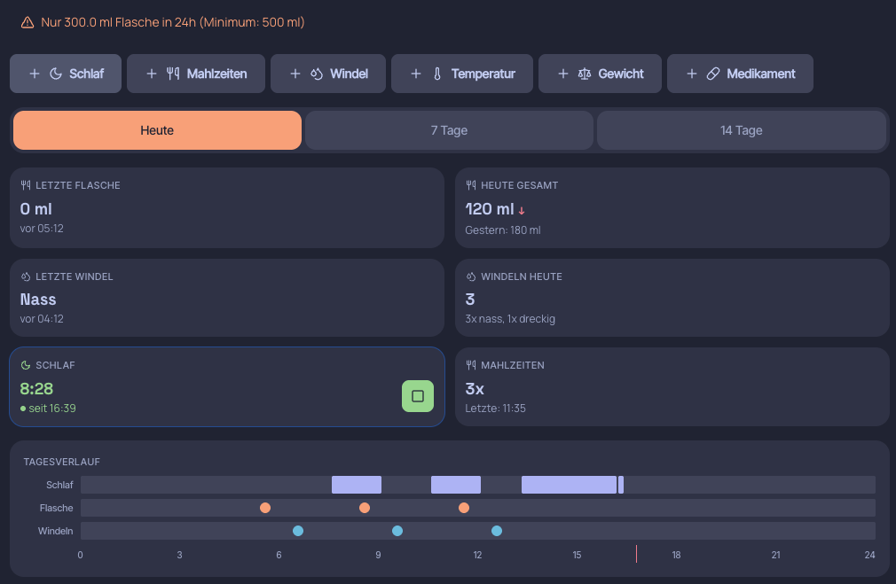
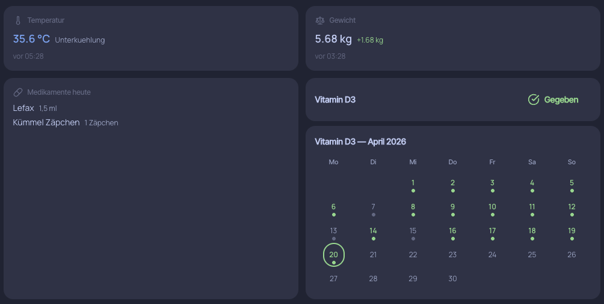
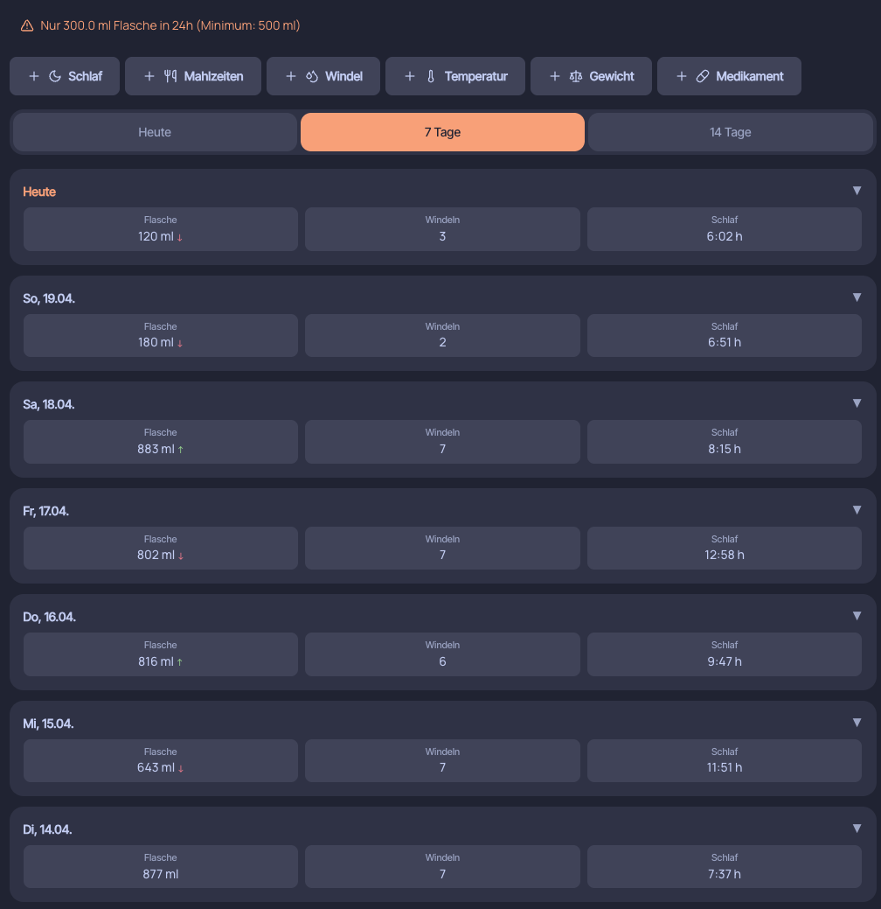
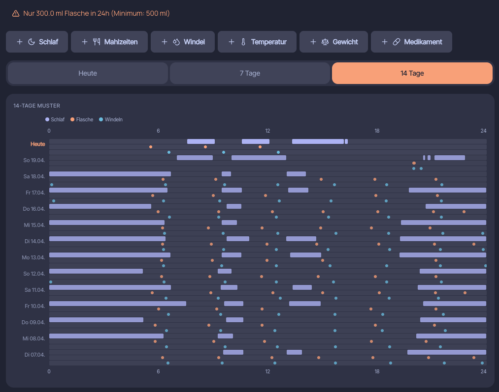
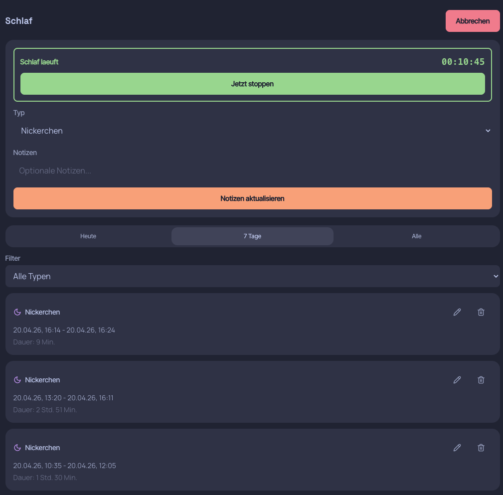
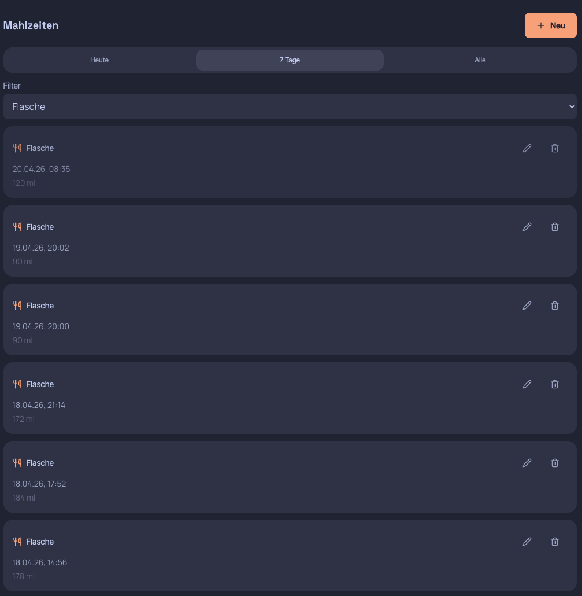
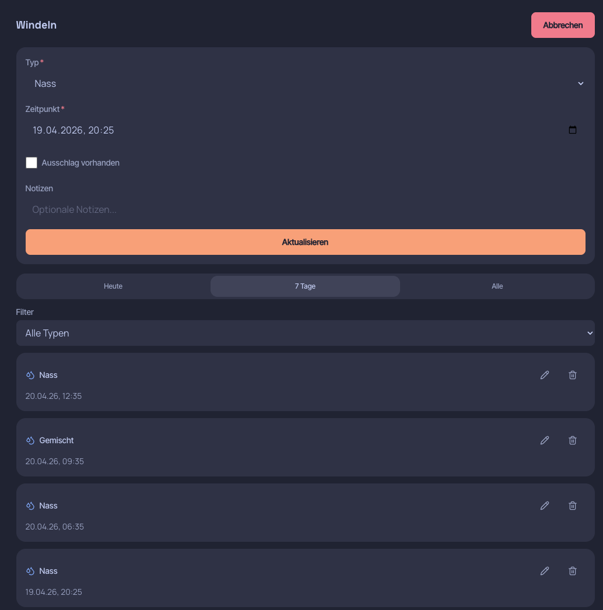

# MyBaby — Self-Hosted Baby Tracker

A privacy-first, plugin-based baby tracking application for self-hosting on your own hardware. Built to replace cloud-dependent baby trackers with a modern, mobile-first experience.

## Why MyBaby?

Your baby's data belongs to you — not to a cloud provider. MyBaby runs entirely on your own server and gives tired parents a fast, one-hand-operable interface to track everything that matters.

- **Privacy by design** — All data stays on your hardware, no cloud sync, no telemetry
- **Mobile-first UI** — Built for one-hand operation at 3 AM with large touch targets and smart presets
- **Plugin architecture** — Modular tracking plugins, easy to extend
- **Self-hosted** — Docker Compose on any NAS, Raspberry Pi, or home server

## Features

| Plugin | What it tracks |
|--------|---------------|
| Sleep | Duration, active timer with start/stop |
| Feeding | Type (breast/bottle/solid), amount, presets |
| Diaper | Wet, dirty, or both |
| Temperature | Body temperature with color-coded alerts |
| Weight | Growth tracking with trend indicators |
| Medication | Doses with master data management |
| Vitamin D3 | Daily supplement calendar |

### Dashboard

- **Today view** — Live summary with active timers and recent entries
- **Day timeline** — Visual 24h overview of all tracking events
- **Pattern charts** — 7-day and 14-day pattern analysis
- **Weekly reports** — Aggregated statistics and trends
- **Alert system** — Configurable warnings per child (fever, weight, etc.)

## Screenshots

### Dashboard

**Today** — At-a-glance summary with live widgets: last feeding, diaper count, active sleep timer, daily totals, and a 24h timeline showing all events.

<p align="center">
  
  
</p>

**7 Days** — Daily breakdown with feeding volumes, diaper counts, and sleep durations. Trend arrows show changes compared to the previous day.

**14 Days** — Pattern chart visualizing sleep blocks, feeding events, and diaper changes across a two-week period. Helps identify routines and irregularities at a glance.

<p align="center">
  
  
</p>

### Tracking

Each plugin provides a form for quick entry and a filterable history list. The sleep plugin includes a live timer with start/stop functionality.

<p align="center">
  
  
  
</p>

## Tech Stack

| Layer | Technology |
|-------|-----------|
| Backend | Python 3.12, FastAPI, SQLAlchemy 2.0, Alembic |
| Frontend | React 18, TypeScript, Tailwind CSS 3, Vite 6 |
| Database | SQLite (WAL mode) |
| Auth | Forward-auth (Authelia/Traefik) + local auth (Argon2) |
| Container | Multi-stage Docker (node:22-alpine + python:3.12-slim) |

## Quick Start

### Docker Compose (recommended)

```yaml
services:
  mybaby:
    image: ghcr.io/xrieros/mybaby:latest
    container_name: mybaby
    restart: unless-stopped
    ports:
      - "8080:8000"
    volumes:
      - ./data:/app/data
    environment:
      - SECRET_KEY=your-secret-key-min-32-chars
      - AUTH_MODE=forward
```

```bash
docker compose up -d
```

Open `http://localhost:8080` in your browser.

### Build from Source

```bash
git clone https://github.com/xRiErOS/myPrivateBabyTracker.git
cd myPrivateBabyTracker
docker compose up -d --build
```

## Configuration

| Variable | Default | Description |
|----------|---------|-------------|
| `SECRET_KEY` | *(required)* | Min 32 characters, app refuses to start without |
| `AUTH_MODE` | `forward` | `forward` (reverse proxy) or `local` (built-in) or `disabled` |
| `AUTH_TRUSTED_HEADER` | `Remote-User` | Header name for forward-auth username |
| `DATABASE_URL` | `sqlite:////app/data/mybaby.db` | SQLite connection string |
| `LOG_LEVEL` | `INFO` | Logging verbosity |

## Design

MyBaby uses the [Catppuccin](https://catppuccin.com/) color palette with automatic light/dark theme switching. The UI philosophy is **"Calm Precision"** — large rounded cards, no borders, no shadows, tonal depth through surface color layering.

See [DESIGN.md](DESIGN.md) for the full design system specification.

## Security

- CSRF double-submit cookie protection
- Content Security Policy headers on all responses
- Input validation with strict Pydantic schemas
- Rate limiting via slowapi
- Header stripping middleware (prevents header injection)

## Project Structure

```
backend/
  app/
    plugins/          # Each plugin: models, schemas, router, widget
    core/             # Auth, config, middleware, security
    api/              # API router aggregation
frontend/
  src/
    plugins/          # Plugin UI components (Form, Widget, List)
    components/       # Shared UI (dashboard, layout, common)
    pages/            # Route pages
data/                 # SQLite database (Docker volume mount)
```

## Development

```bash
# Backend
cd backend
python -m venv .venv && source .venv/bin/activate
pip install -r requirements.txt
pytest

# Frontend
cd frontend
npm install
npm run dev
```

## Roadmap

### v0.1.0 — MVP (done)
- [x] Core tracking plugins: sleep, feeding, diaper
- [x] Auth middleware + security hardening
- [x] Frontend shell + plugin components
- [x] Docker deployment
- [x] Baby Buddy data import

### v0.2.0 — Extended Tracking (done)
- [x] Temperature, weight, and medication plugins
- [x] Adaptive bottom navigation
- [x] Alert system with configurable thresholds
- [x] Dashboard alert banner

### v0.3.0 — UX Polish + Master Data (done)
- [x] Medication master data management
- [x] Dashboard live timer (start/stop)
- [x] Temperature stepper (+/- buttons) and hypothermia warning
- [x] Required field indicators, visual tab separation

### v0.4.0 — Organization (planned)
- [ ] Tag system for all entries
- [ ] Baby to-do list

### v0.6.0 — Advanced Alerts (planned)
- [ ] Enhanced alert visuals
- [ ] Age-specific warning thresholds

### Future
- [ ] Multi-child support
- [ ] Data export (CSV, JSON)
- [ ] Progressive Web App (PWA)
- [ ] Growth percentile charts (WHO data)

## License

MIT License — see [LICENSE](LICENSE) for details.

## Acknowledgments

- [Catppuccin](https://catppuccin.com/) — Color palette
- [Baby Buddy](https://github.com/babybuddy/babybuddy) — Original inspiration
