# MyBaby — Feature-Abhängigkeiten

Stand: 2026-04-29 · ergänzt `docs/FEATURES.md`.

Dieser Graph zeigt, welche Features auf andere angewiesen sind. Pflicht-Lektüre vor jedem Refactor — er beantwortet die Frage: "Was bricht, wenn ich X anfasse?"

## Legende

| Typ | Bedeutung |
|-----|-----------|
| `requires` | Feature funktioniert nicht ohne das andere. Harte Abhängigkeit. |
| `extends`  | Feature baut auf dem anderen auf, fügt aber neue Funktionalität hinzu (z.B. Frühgeborenen-Modus extends Children-Management). |
| `optional` | Feature nutzt das andere, wenn vorhanden — funktioniert aber auch ohne (z.B. Tag-System auf Plugin-Eintraegen). |

## Graph (Mermaid)

```mermaid
graph TD
    subgraph Foundation
        DB[Database / Alembic]
        Auth[Auth-System]
        Children[Children-Management]
        Plugins[Plugin-Architektur]
    end

    subgraph CrossCutting
        Tags[Tag-System]
        Alerts[Warnhinweise]
        UserPrefs[User-Preferences]
        AdminHub[Admin-Hub]
        ApiKeys[API-Keys]
        TOTP[2FA TOTP]
        Passkeys[Passkeys WebAuthn]
        Logging[Logging / Admin-Logs]
        Tutorial[Tutorial / Onboarding]
        i18n[i18n]
        Theme[Catppuccin Theme]
    end

    subgraph TrackingPlugins
        Sleep[sleep]
        Feeding[feeding]
        Diaper[diaper]
        Temperature[temperature]
        Weight[weight]
        Medication[medication]
        VitD3[vitamind3]
        Health[health]
        TummyTime[tummytime]
        Todo[todo]
        Notes[notes]
    end

    subgraph DevelopmentPlugins
        Milestones[milestones]
        Growth[growth]
        Checkup[checkup]
    end

    subgraph FrontendShell
        Dashboard[Dashboard]
        Layout[Layout / Nav]
        Forms[Plugin Forms]
        AuthGuard[Auth-Guard]
        ErrorBoundary[ErrorBoundary]
        ChildSelector[Child-Selector]
    end

    DB --> Auth
    DB --> Children
    DB --> Plugins
    DB --> Tags
    DB --> Alerts
    DB --> UserPrefs
    DB --> ApiKeys
    DB --> Logging

    Auth --> TOTP
    Auth --> Passkeys
    Auth --> ApiKeys
    Auth --> AuthGuard
    Auth --> AdminHub
    Auth --> UserPrefs

    Children --> Plugins
    Children --> Sleep
    Children --> Feeding
    Children --> Diaper
    Children --> Temperature
    Children --> Weight
    Children --> Medication
    Children --> VitD3
    Children --> Health
    Children --> TummyTime
    Children --> Todo
    Children --> Notes
    Children --> Milestones
    Children --> Growth
    Children --> Checkup
    Children --> Alerts
    Children --> ChildSelector

    Plugins --> Sleep
    Plugins --> Feeding
    Plugins --> Diaper
    Plugins --> Temperature
    Plugins --> Weight
    Plugins --> Medication
    Plugins --> VitD3
    Plugins --> Health
    Plugins --> TummyTime
    Plugins --> Todo
    Plugins --> Notes
    Plugins --> Milestones
    Plugins --> Growth
    Plugins --> Checkup
    Plugins --> Dashboard

    Tags -.optional.-> Sleep
    Tags -.optional.-> Feeding
    Tags -.optional.-> Diaper
    Tags -.optional.-> Temperature
    Tags -.optional.-> Weight
    Tags -.optional.-> Medication
    Tags -.optional.-> Health
    Tags -.optional.-> TummyTime
    Tags -.optional.-> Milestones

    Alerts --> Sleep
    Alerts --> Feeding
    Alerts --> Diaper
    Alerts --> Temperature
    Alerts -.optional.-> Milestones

    Growth -. reads .-> Weight
    Growth -. reads .-> Children
    Milestones -. extends .-> Children
    Checkup -. extends .-> Children

    UserPrefs --> Dashboard
    UserPrefs --> Layout
    UserPrefs --> Feeding
    UserPrefs --> Tutorial

    Tutorial --> Layout
    Tutorial -. data-tutorial markers .-> Dashboard
    Tutorial -. data-tutorial markers .-> Forms
    i18n --> Tutorial

    AdminHub --> Plugins
    AdminHub --> ApiKeys
    AdminHub --> Alerts
    AdminHub --> Logging

    AuthGuard --> Layout
    Layout --> Dashboard
    Layout --> Forms
    ErrorBoundary --> Layout
    ChildSelector --> Layout

    i18n --> Layout
    i18n --> Forms
    i18n --> Dashboard
    Theme --> Layout
```

## Tabellarische Übersicht

### Foundation (Layer 0)

Alles baut auf diesen drei Bausteinen auf. Ein Eingriff hier hat den größten Blast Radius.

| Feature | Datei(en) | Konsumenten |
|---------|-----------|-------------|
| Database / Alembic | `backend/app/database.py`, `backend/alembic/` | ALLE |
| Auth-System (4 Modi) | `backend/app/api/auth.py`, `frontend/src/hooks/useAuth.ts` | TOTP, Passkeys, API-Keys, AuthGuard, AdminHub, UserPrefs |
| Plugin-Architektur | `backend/app/plugins/_base.py`, `backend/app/plugins/registry.py` | alle 14 Plugins, Dashboard |

### Layer 1 — Cross-cutting Domain

Features, die mehrere Plugins berühren.

| Feature | requires | optional von | extends |
|---------|----------|---------------|---------|
| Children-Management | DB | – | – |
| Tag-System | DB, Plugins | Sleep, Feeding, Diaper, Temperature, Weight, Medication, Health, TummyTime, Milestones | – |
| Warnhinweise (Alerts) | DB, Children, Sleep, Feeding, Diaper, Temperature | Milestones (Sturmphase via LeapDefinition) | – |
| User-Preferences | DB, Auth | – | – |
| API-Keys | DB, Auth | – | – |
| 2FA TOTP | DB, Auth | – | – |
| Passkeys WebAuthn | DB, Auth | – | – |
| Admin-Logs | DB, Auth | – | – |
| Tutorial / Onboarding | UserPrefs (Persistenz), i18n, Layout (data-tutorial-Marker), React-Router (navigate für Off-Path-Resume) | Header, Sidebar, MobileMenu, Dashboard (BabySummary), ViewTabs, FAB, AdminPage, PluginConfigPage, SleepPage, ChildrenPage | – |

### Layer 2 — Tracking Plugins (parallel, austauschbar)

Diese Plugins können aktiviert/deaktiviert werden, ohne dass andere brechen — nur Base-Plugins (sleep, feeding, diaper) müssen aktiv bleiben.

| Plugin | requires | besondere Hinweise |
|--------|----------|--------------------|
| sleep (Base) | DB, Children, Plugins | Timer-Logik in `SleepForm.tsx`. Auto-Nachtschlaf 22–06. |
| feeding (Base) | DB, Children, Plugins, UserPrefs | Stillmodus-Toggle aus User-Preferences. |
| diaper (Base) | DB, Children, Plugins | – |
| temperature | DB, Children, Plugins | – |
| weight | DB, Children, Plugins | Konsumiert von growth. |
| medication | DB, Children, Plugins, MedicationMaster (optional) | MedicationMaster ist optional (Freitext-Fallback). |
| vitamind3 | DB, Children, Plugins | Inline im BabySummary-Grid (kein Widget-Slot). |
| health | DB, Children, Plugins | Typed: spit_up, tummy_ache, crying. |
| tummytime | DB, Children, Plugins | Timer-Logik analog Sleep. |
| todo | DB, Children, Plugins | 3 Modelle: TodoEntry, TodoTemplate, Habit. |
| notes | DB, Children, Plugins | Eigenes Dashboard-Widget statt Plugin-Widget-Slot. |

### Layer 3 — Development Plugins

Plugins, die andere Daten konsumieren oder das Children-Modell erweitern.

| Plugin | requires | extends | reads |
|--------|----------|---------|-------|
| milestones | DB, Children, Plugins | Children (`is_preterm`, `estimated_birth_date`) für Leap-Berechnung | – |
| growth | DB, Children, Plugins | – | weight, children (für korrigiertes Alter). Daten aus `services/who_data.py`. |
| checkup | DB, Children, Plugins | Children (Frühgeborenen-Anpassung von Zeitfenstern) | – |

### Layer 4 — Frontend Shell

| Feature | requires |
|---------|----------|
| AuthGuard | Auth-System |
| Layout / Nav | AuthGuard, Plugin-Config, ChildSelector, i18n, Theme |
| Dashboard | Layout, alle aktivierten Plugins (für Widgets), User-Preferences (für Widget-Order) |
| ErrorBoundary | – (top-level) |
| ChangelogOverlay | – (liest localStorage + `/api/v1/changelog`) |
| TutorialOverlay | UserPreferences, i18n, React-Router. Lauscht auf `mybaby:tutorial:child-created` (ChildrenPage), dispatched `mybaby:tutorial:open/close-mobile-menu` (Header) und `mybaby:tutorial:sleep-tab-list` (SleepPage). |

## Kritische Pfade (Refactor-Risiko)

Diese Pfade sind besonders sensibel — Änderungen hier brechen viele Konsumenten.

1. **`backend/app/plugins/_base.py`** — Plugin-Basis-Interface. Schnittstellen-Änderung bricht alle 14 Plugins.
2. **`backend/app/database.py`** — DB-Session-Handling. Bricht alle Routes.
3. **`backend/app/middleware/auth.py`** — Wechsel des Auth-Modus oder JWT-Format bricht jede authentifizierte Route.
4. **`frontend/src/lib/pluginRegistry.ts`** — Plugin-Liste. Hinzufügen ohne Backend-Plugin → Frontend-Crashes.
5. **`frontend/src/api/client.ts`** — Axios-Basis. 401-Handler-Änderung bricht Auto-Logout.
6. **`backend/app/models/child.py`** — Child-Schema-Änderung bricht alle Plugin-Models (FK).
7. **`backend/app/services/alert_service.py`** — Alert-Logik nutzt Plugin-Daten direkt (kein Plugin-Hook).
8. **`backend/alembic/env.py`** — Plugin-Discovery für Migrations. Falsche Reihenfolge → Migrations-Fail.
9. **`frontend/src/components/tutorial/tutorialSteps.ts`** — Step-Definitionen mit CSS-Selektoren (`data-tutorial="..."`). Entfernen oder Umbenennen eines Markers in einer Layout/Page-Komponente bricht den entsprechenden Step still (Spotlight findet nichts → fällt auf Full-Backdrop zurück, wirkt visuell leer).

## Wartung

Diese Datei wird bei größeren Architektur-Änderungen aktualisiert. Pflicht-Updates bei:

- Neues Plugin → in Layer 2 oder 3 aufnehmen, Pfeile zu requires-Targets ergänzen.
- Neue Cross-cutting Domain → in Layer 1, Tabelle "requires/optional" pflegen.
- Verschieben von Schnittstellen → "Kritische Pfade" überprüfen.

Verantwortlich: Coding Lead-Agent oder Scrum Master vor Sprint-Close.
